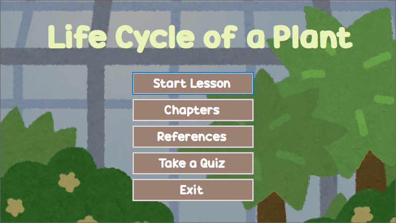
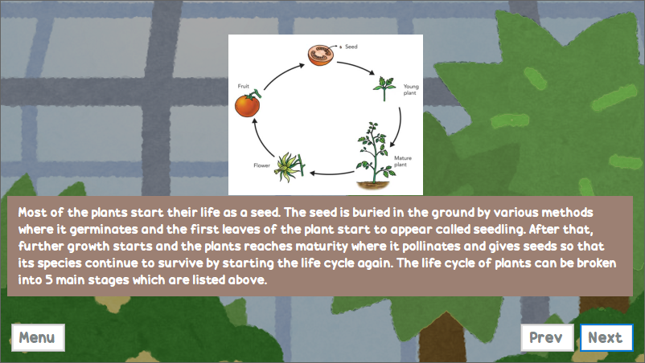
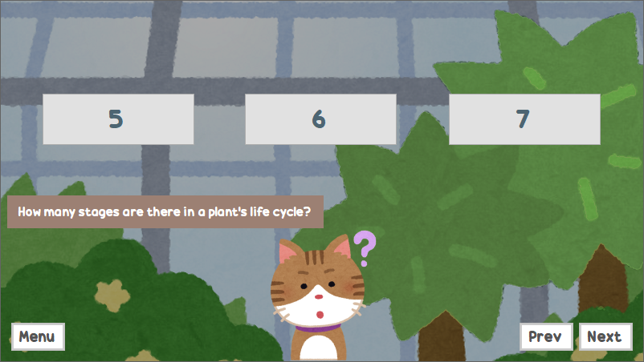
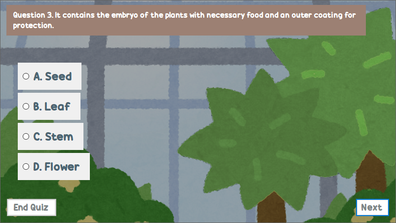

# 🌱 PlantCycleExplorer

PlantCycleExplorer is a Windows Forms educational application designed to teach users about the life cycle of plants. The app provides interactive lessons, quizzes (multiple choice and true/false), and visual aids to help users understand key concepts in plant biology.

## 🖼️ Screenshots

### Home

### Lesson

### Question

### Quiz

## ✨ Features

- 📖 **Interactive Lessons:** Step-by-step explanations of each stage in a plant's life cycle.
- 🗂️ **Chapters Navigation:** Jump to specific topics or stages for focused learning.
- 📝 **Quizzes:** Test your knowledge with multiple choice and true/false questions.
- 🖼️ **Visual Aids:** Includes images and diagrams to enhance understanding.
- 🖱️ **User-Friendly Interface:** Simple navigation with menu and chapter selection.

## 🚀 Getting Started

### Prerequisites

- 🪟 Windows OS
- [.NET Framework 4.7.2](https://dotnet.microsoft.com/download/dotnet-framework/net472)
- Visual Studio (recommended for building from source)

### Installation Guide

1. Clone or download this repository.
2. Open `WindowsFormsApp9.sln` in Visual Studio.
3. Build the solution.
4. Run the application.

## 📁 Project Structure

- `WindowsFormsApp9/` - Main application source code.
  - `Form1.cs` - Main lesson and navigation form.
  - `Form2.cs` - Quiz form (multiple choice and true/false).
  - `Properties/Resources.resx` - Embedded images and resources.
  - `Resources/` - Image assets for lessons and quizzes.

## 🙏 Credits

- Lesson content: [science4fun.info/life-cycle-of-plants](https://science4fun.info/life-cycle-of-plants/)
- Images: [irasutoya.com](https://www.irasutoya.com/)

## 📄 License

This project is licensed under the MIT License. See [LICENSE](LICENSE) for details.

## 📝 Note
This project was created as part of my Computer Programming 2 course during my 1st year in college, and was submitted on April 25, 2022.
